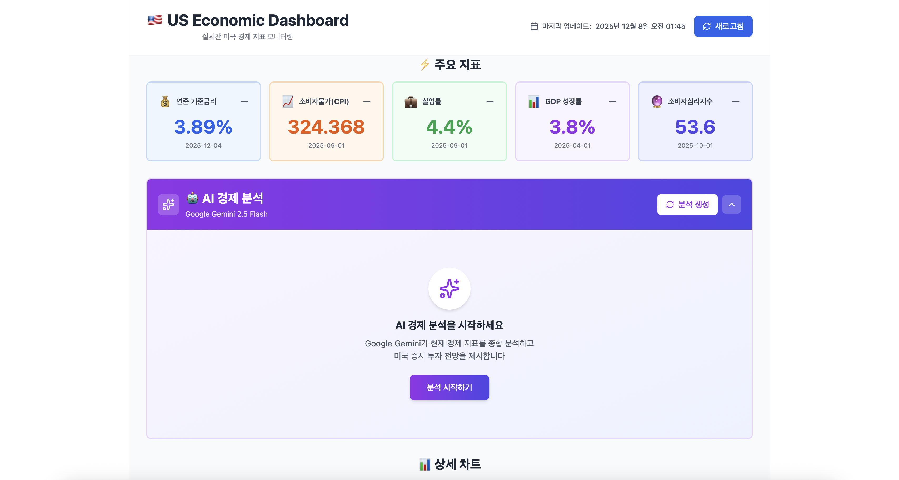
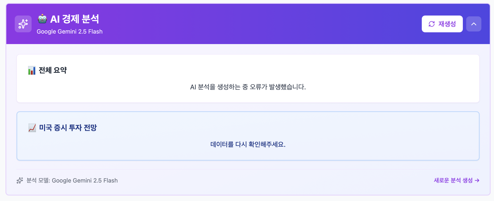
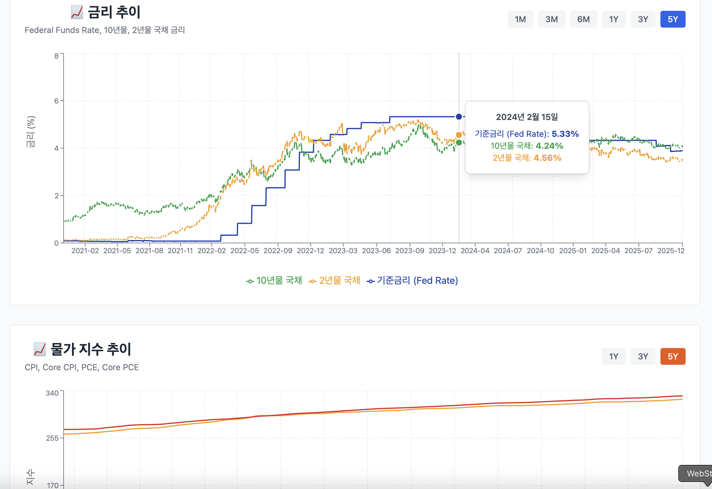

# 🇺🇸 US Economic Dashboard

미국 경제 지표를 실시간으로 모니터링하고 AI가 분석하는 대시보드


## 📊 주요 기능

### 1. 실시간 경제 지표 모니터링
- **금리**: 연준 기준금리, 10년물/2년물 국채, 장단기 금리차, 모기지 금리
- **물가**: CPI, Core CPI, PCE, Core PCE
- **고용**: 실업률, 비농업 고용, 신규 실업수당 청구, 구인
- **GDP**: 실질 GDP, 성장률, 산업생산지수
- **경기선행지수**: 소비자심리, 주택건축허가, 소매판매

### 2. 인터랙티브 차트
- 📈 5개의 인터랙티브 차트 (Recharts)
- 기간별 데이터 조회 (1개월 ~ 5년)
- 반응형 디자인 (모바일/태블릿/데스크톱)
- 실시간 툴팁 및 데이터 시각화

### 3. AI 경제 분석
- 🤖 Google Gemini 2.5 Flash 활용
- 전체 경제 상황 요약
- 미국 증시 투자 전망
- 재생성 기능

### 4. Quick Metrics
- ⚡ 주요 지표 5개 한눈에 보기
- 색상 코딩으로 카테고리 구분
- 최신 데이터 및 날짜 표시

---

## 🏗️ 기술 스택

### Backend
- **Framework**: FastAPI 0.104
- **API**: FRED (Federal Reserve Economic Data)
- **AI**: Google Gemini 2.5 Flash
- **Data Processing**: Pandas, NumPy
- **Async HTTP**: httpx

### Frontend
- **Framework**: React 18 + Vite
- **UI Library**: Tailwind CSS
- **Charts**: Recharts
- **Icons**: Lucide React
- **HTTP Client**: Axios

---

## 📁 프로젝트 구조
```
us-economic-dashboard/
├── backend/
│   ├── app/
│   │   ├── main.py                 # FastAPI 진입점
│   │   ├── config.py               # 환경 설정
│   │   ├── models/                 # 데이터 모델
│   │   ├── services/
│   │   │   ├── fred_service.py     # FRED API 서비스
│   │   │   ├── gemini_service.py   # Gemini AI 서비스
│   │   │   └── data_processor.py   # 데이터 가공
│   │   ├── routes/
│   │   │   ├── indicators.py       # 지표 API
│   │   │   └── analysis.py         # AI 분석 API
│   │   └── utils/
│   │       └── constants.py        # 상수 정의
│   ├── requirements.txt
│   └── .env.example
│
├── frontend/
│   ├── src/
│   │   ├── components/
│   │   │   ├── Header.jsx
│   │   │   ├── IndicatorCard.jsx
│   │   │   ├── AIAnalysisPanel.jsx
│   │   │   └── charts/
│   │   │       ├── InterestRateChart.jsx
│   │   │       ├── InflationChart.jsx
│   │   │       ├── EmploymentChart.jsx
│   │   │       ├── GDPChart.jsx
│   │   │       └── LEIChart.jsx
│   │   ├── services/
│   │   │   └── api.js              # API 클라이언트
│   │   ├── App.jsx
│   │   └── main.jsx
│   ├── package.json
│   └── vite.config.js
│
└── README.md
```

---

## 🚀 시작하기

### 사전 요구사항

- Python 3.9 이상
- Node.js 18 이상
- FRED API Key ([발급 링크](https://fred.stlouisfed.org/))
- Google Gemini API Key ([발급 링크](https://aistudio.google.com/))

### 1. 저장소 클론
```bash
git clone https://github.com/jsha2217/us-economic-dashboard.git
cd us-economic-dashboard
```

### 2. 백엔드 설정
```bash
# backend 폴더로 이동
cd backend

# 가상환경 생성
python -m venv venv

# 가상환경 활성화
# Windows:
venv\Scripts\activate
# Mac/Linux:
source venv/bin/activate

# 패키지 설치
pip install -r requirements.txt

# 환경 변수 설정
cp .env.example .env
# .env 파일을 열고 API 키 입력
```

#### .env 설정
```env
FRED_API_KEY=your_fred_api_key_here
GEMINI_API_KEY=your_gemini_api_key_here
HOST=0.0.0.0
PORT=8000
DEBUG=True
CACHE_TTL=3600
```

### 3. 프론트엔드 설정
```bash
# 새 터미널 열기
cd frontend

# 패키지 설치
npm install
```

### 4. 실행

#### 백엔드 실행 (터미널 1)
```bash
cd backend
uvicorn app.main:app --reload
```

백엔드 서버: http://localhost:8000
API 문서: http://localhost:8000/docs

#### 프론트엔드 실행 (터미널 2)
```bash
cd frontend
npm run dev
```

프론트엔드: http://localhost:5173

---

## 📸 스크린샷

### 대시보드 메인


### AI 분석 패널


### 차트 상세


---

## 🔑 API 키 발급

### FRED API Key

1. https://fred.stlouisfed.org/ 접속
2. 우측 상단 "My Account" → "API Keys"
3. "Request API Key" 클릭
4. 용도 작성 후 발급

### Google Gemini API Key

1. https://aistudio.google.com/ 접속
2. "Get API key" 클릭
3. 프로젝트 선택 또는 생성
4. API 키 복사

---

## 📊 API 엔드포인트

### 경제 지표 API
```
GET /api/indicators/interest-rates?period=1y
GET /api/indicators/inflation?period=1y
GET /api/indicators/employment?period=1y
GET /api/indicators/gdp?period=5y
GET /api/indicators/leading?period=1y
GET /api/indicators/summary
```

**Query Parameters:**
- `period`: `1m`, `3m`, `6m`, `1y`, `3y`, `5y`

### AI 분석 API
```
POST /api/analysis/generate
GET /api/analysis/test
```

---

## 🛠️ 개발

### 코드 스타일

- **Backend**: PEP 8 (Python)
- **Frontend**: ESLint + Prettier

### 주요 라이브러리

#### Backend
```txt
fastapi==0.104.1
uvicorn[standard]==0.24.0
httpx==0.25.1
pandas==2.1.3
google-generativeai>=0.8.0
```

#### Frontend
```json
{
  "react": "^18.3.1",
  "recharts": "^2.12.0",
  "tailwindcss": "^3.4.1",
  "axios": "^1.7.0",
  "lucide-react": "^0.263.1"
}
```

---

## 📝 주요 기능 설명

### 1. FRED API 연동
```python
# backend/app/services/fred_service.py
class FREDService:
    async def get_series(self, series_id: str, start_date: str, end_date: str):
        # FRED API에서 경제 지표 데이터 가져오기
        ...
```

### 2. Google Gemini AI 분석
```python
# backend/app/services/gemini_service.py
class GeminiService:
    async def analyze_economy(self, indicators: Dict):
        # AI가 경제 지표를 분석하고 전망 제시
        ...
```

### 3. 차트 컴포넌트
```javascript
// frontend/src/components/charts/InterestRateChart.jsx
function InterestRateChart() {
  // Recharts를 사용한 인터랙티브 차트
  return <LineChart data={data}>...</LineChart>
}
```

---

## 🚢 배포

### Vercel (프론트엔드)
```bash
cd frontend
npm run build
# Vercel에 배포
```

### Railway/Render (백엔드)
```bash
cd backend
# requirements.txt와 함께 배포
```

---


## 📄 라이선스

MIT License

---

## 👨‍💻 개발자

**jsha2217**
- GitHub: [@jsha2217](https://github.com/jsha2217)

---


## 📞 문의

프로젝트에 대한 질문이나 제안사항이 있으시면 Issue를 생성해주세요.

